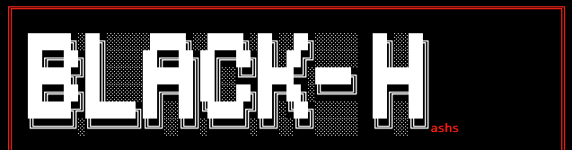
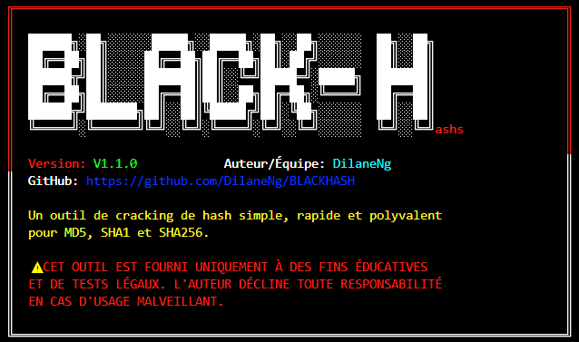
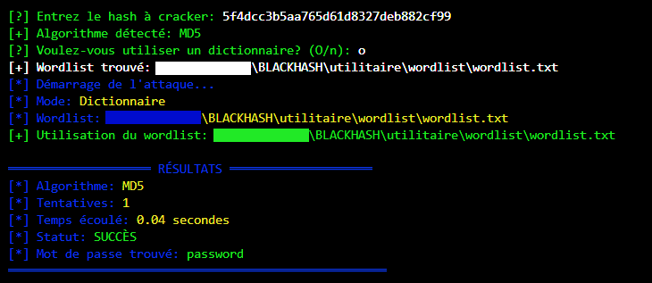

# 🕶️ BLACKHASH



[](https://github.com/DilaneNg/BLACKHASH)
[](https://www.python.org/)
[]()
[](LICENSE)

---

## 📋 Description  
**BLACKHASH** est un outil de cracking de hash développé en **Python** qui permet de retrouver des mots de passe à partir de leurs empreintes cryptographiques.  
L'outil supporte deux modes d'attaque : **par dictionnaire** et **par force brute**.

---

## ✨ Fonctionnalités
- 🔍 Détection automatique du type de hash (**MD5, SHA1, SHA256**)  
- 📚 Attaque par dictionnaire avec support des fichiers compressés (`.gz`)  
- 💪 Attaque par force brute personnalisable  
- 🎨 Interface colorée et conviviale  
- ⚡ Affichage en temps réel de la progression  
- 🐧 Multiplateforme (**Windows et Linux**)  
- 🔧 Gestion automatique des wordlists  

---

## 📦 Installation  

### 🔑 Prérequis
- Python **3.x**  
- pip (gestionnaire de paquets Python)  

### ⚙️ Installation des dépendances
```bash
pip install colorama
```

### 📥 Téléchargement
```bash
git clone https://github.com/DilaneNg/BLACKHASH.git
cd BLACKHASH
```

---

## 🚀 Utilisation  

### Mode simple
```bash
python BlackHash.py
```
👉 L'outil vous guidera interactivement pour saisir le hash et choisir les options.

### Mode avancé avec arguments
```bash
python BlackHash.py [HASH] [OPTIONS]
```

#### 📑 Options disponibles
| Option | Description |
|--------|-------------|
| `-h, --help` | Affiche l'aide |
| `-a ALGO, --algorithm ALGO` | Spécifie l'algorithme (**MD5/SHA1/SHA256**) |
| `-w FICHIER, --wordlist FICHIER` | Chemin vers le fichier wordlist |
| `-b, --bruteforce` | Utilise l'attaque par force brute |
| `-m LONGUEUR, --max-length LONGUEUR` | Longueur maximale pour le bruteforce *(défaut: 8)* |

#### Exemples

- **Attaque par dictionnaire :**
```bash
python BlackHash.py 5f4dcc3b5aa765d61d8327deb882cf99 -a MD5 -w wordlist.txt
```

- **Attaque par force brute :**
```bash
python BlackHash.py 5f4dcc3b5aa765d61d8327deb882cf99 -b -m 6
```

---

## 📁 Structure des wordlists  

L'outil recherche automatiquement les wordlists dans plusieurs emplacements :
- Répertoire courant  
- `./utilitaire/wordlist/`  
- `/usr/share/wordlists/` *(Linux)*  

**Fichiers par défaut :**
- `wordlist.txt`  
- `common_passwords.txt`  
- `rockyou.txt`  

### ➕ Création d'un wordlist personnalisé
Créez un fichier texte avec un mot de passe par ligne :
```bash
# Exemple de wordlist simple
password
123456
admin
qwerty
letmein
```

---

## 🛠️ Algorithmes supportés
- **MD5** → 32 caractères hexadécimaux  
- **SHA1** → 40 caractères hexadécimaux  
- **SHA256** → 64 caractères hexadécimaux  

---

## ⚠️ Avertissement légal
Cet outil est fourni uniquement à des fins **éducatives** et de **tests légaux**.  
L'auteur décline toute responsabilité en cas d'usage malveillant.  
👉 **N'utilisez cet outil que sur des systèmes dont vous avez l'autorisation explicite.**

---

## 📸 Screenshots
  
> **MENU**

  

> **ATTAQUE**

  

---

## 📞 Support
- Auteur/Équipe : **DilaneNg**  
- GitHub : [https://github.com/DilaneNg/BLACKHASH](https://github.com/DilaneNg/BLACKHASH)  
- Version : **V1.1.0**  

---

## 📄 Licence
Ce projet est **open source** sous licence [MIT](LICENSE).  
